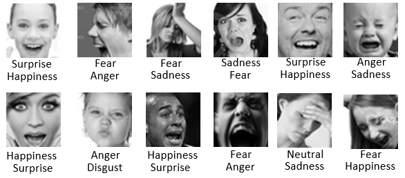

# TransFER - Facial Expression Recognition with Transformers (FER+ Re-implementation)

> PyTorch re-implementation of:  
> **TransFER: Learning Relation-aware Facial Expression Representations with Transformers**  
> [Paper link](https://arxiv.org/pdf/2108.11116)

---

## Giới thiệu

Dự án này là bản triển khai lại mô hình **TransFER** cho bài toán nhận diện biểu cảm khuôn mặt. Mô hình được huấn luyện lại hoàn toàn trên tập dữ liệu **FERPlus**. Mô hình **TransFER** có khả năng học được các biểu diễn cục bộ giàu quan hệ-ngữ cảnh. Mô hình này bao gồm ba thành phần chính: **Multi Attention Dropping (MAD)**, **ViT-FER**, và **Multi-head Self-Attention Dropping (MSAD)**.


---

## Cấu trúc thư mục

```
TransFER/
├── code/
│ ├── transfer_model.py # Mô hình TransFER
│ ├── train.py # Huấn luyện mô hình
│ └── fer_realtime_demo.py # Chạy thử mô hình thời gian thực
│
├── dataset/
│ ├── FER_Image/ # Hình ảnh để huấn luyện
│ └── Label/ # Nhãn huấn luyện
│
├── images/ # Biểu đồ loss/accuracy, minh họa
└── README.md
```

---

## Dataset

FER+ là bộ nhãn mở rộng cho FER2013, trong đó mỗi ảnh được gán nhãn bởi 10 người thay vì 1 nhãn đơn. Điều này cho phép biểu diễn cảm xúc dưới dạng phân phối xác suất hoặc đa nhãn, thay vì chỉ một nhãn duy nhất.

Dưới đây là một số mẫu của FER và FER+ (FER top, FER+ bottom):


Ở đây chúng tôi đã tải ảnh gốc và lưu lại nhãn mới trong thư mục FER_Image và Label. Hoặc có thể tại dataset gốc tại đây: [FERPlus dataset](https://github.com/microsoft/FERPlus/tree/master)

---

## Result

Kết quả đạt được sau khi huấn luyện mô hình trên tập test là 84.95%

Chúng tôi đã huấn luyện mô hình và lưu lại trọng số cho kết quả tốt nhất trên tập validation. [Google Drive](https://drive.google.com/drive/u/4/folders/1DuqNhhV9suTmlCnYC9a5fAZ2cR_1NVNy)

Để demo mô hình hãy lưu các file trọng số này cùng với file fer_realtime_demo.py

---

## Notice

Repo này là một bản triển khai lại từ bài báo:
TransFER: Learning Relation-aware Facial Expression Representations with Transformers.

Tác giả gốc không công bố mã nguồn và bộ dữ liệu mà đã được xử lý theo như bài báo.

Dự án này được thực hiện lại với ý tưởng từ bài báo gốc cũng như cách xử lý dữ liệu.

Dự án được dùng để phục vụ mục đích học tập và nghiên cứu. Mọi người có thể tham khảo từ dự án này hoặc xem bài báo gốc để hiểu rõ chi tiết.

---
